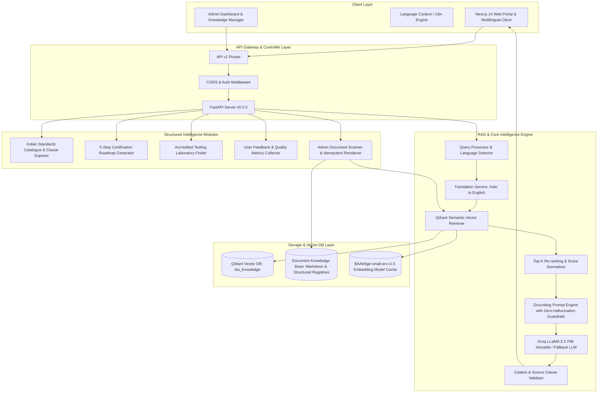

# e-BIS Sahayak — Complete System Architecture & Technical Specification
**Smart India Hackathon 2026 • Problem Statement SIH26107**  
*AI-Powered Intelligent Assistant for Indian Standards & BIS Services*

---

## 1. System Architecture Diagram

---

## 2. Component Specifications

### 2.1 Embedding & Vector Search Pipeline
- **Embedding Model**: `BAAI/bge-small-en-v1.5` (Dense representation, 384 dimensions, cosine distance).
- **Chunking Strategy**: Semantic clause-preserving chunking (500 tokens chunk size, 100 tokens overlap) with hierarchical metadata tags (`standard_id`, `clause_number`, `document_type`, `division`).
- **Vector Database**: Qdrant Vector Engine with HNSW indexing for sub-15ms vector similarity queries.

### 2.2 RAG Verification & Grounding Engine
- **Prompt Engineering**: Strict zero-hallucination system prompt that commands the LLM to only answer based on retrieved evidence chunks and explicitly refuse out-of-domain queries.
- **Citation Extractor**: Automated regex & metadata correlation mapping citations to exact IS numbers and clause titles.

### 2.3 Multilingual Indic Pipeline
- Seamless translation bridge converting Hindi/Tamil user queries into English retrieval vectors while generating responses in the user's native Indic script.

### 2.4 Administrative Lifecycle Management
- SHA-256 file fingerprinting preventing duplicate ingestion.
- Idempotent document re-indexing for live knowledge updates without downtime.
