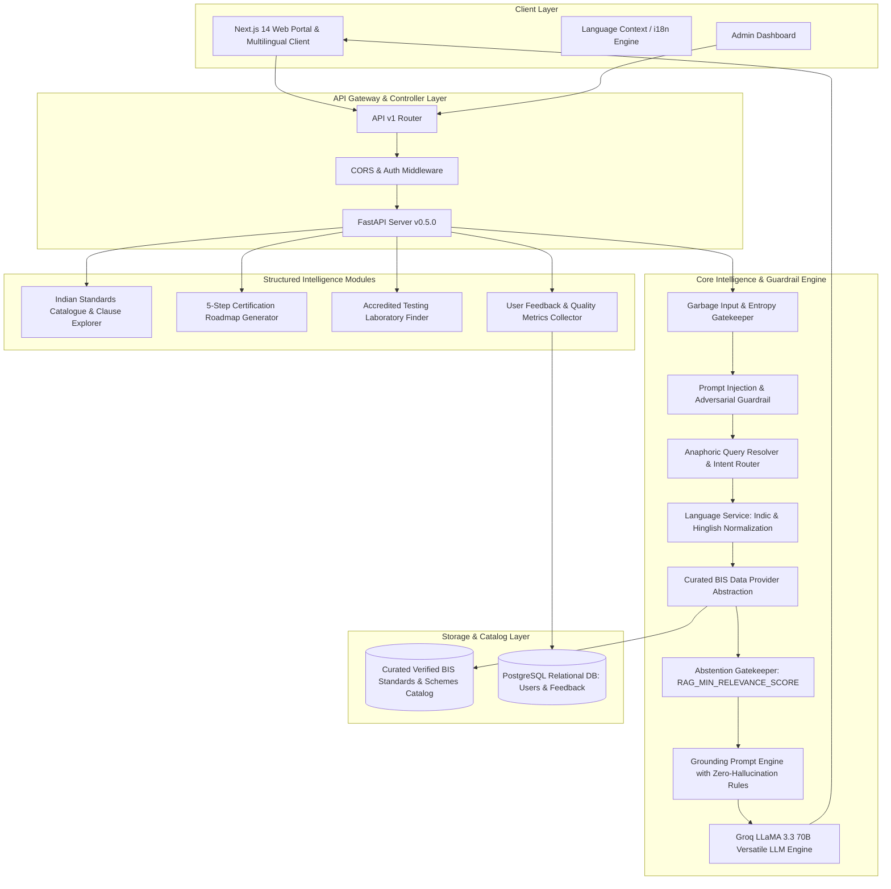

# e-BIS Sahayak — Complete System Architecture & Technical Specification
**Smart India Hackathon 2026 • Problem Statement SIH26107**  
*AI-Powered Intelligent Assistant for Indian Standards & BIS Services*

---

## 1. System Architecture Diagram

```mermaid
graph TB
    subgraph Client Layer
        UI[Next.js 14 Web Portal & Multilingual Client]
        LangCtx[Language Context / i18n Engine]
        AdminUI[Admin Dashboard]
    end

    subgraph API Gateway & Controller Layer
        FastAPI[FastAPI Server v0.5.0]
        CORS[CORS & Auth Middleware]
        Router[API v1 Router]
    end

    subgraph Core Intelligence & Guardrail Engine
        InputGate[Garbage Input & Entropy Gatekeeper]
        SecGuard[Prompt Injection & Adversarial Guardrail]
        QueryProc[Anaphoric Query Resolver & Intent Router]
        TransService[Language Service: Indic & Hinglish Normalization]
        DataProvider[Curated BIS Data Provider Abstraction]
        AbstentionGate[Abstention Gatekeeper: RAG_MIN_RELEVANCE_SCORE]
        PromptAssembler[Grounding Prompt Engine with Zero-Hallucination Rules]
        LLMDriver[Groq LLaMA 3.3 70B Versatile LLM Engine]
    end

    subgraph Structured Intelligence Modules
        StandardsModule[Indian Standards Catalogue & Clause Explorer]
        CertRoadmap[5-Step Certification Roadmap Generator]
        LabDirectory[Accredited Testing Laboratory Finder]
        FeedbackModule[User Feedback & Quality Metrics Collector]
    end

    subgraph Storage & Catalog Layer
        SeedCatalog[(Curated Verified BIS Standards & Schemes Catalog)]
        Postgres[(PostgreSQL Relational DB: Users & Feedback)]
    end

    UI --> Router
    AdminUI --> Router
    Router --> CORS
    CORS --> FastAPI

    FastAPI --> InputGate
    InputGate --> SecGuard
    SecGuard --> QueryProc
    QueryProc --> TransService
    TransService --> DataProvider
    DataProvider --> SeedCatalog
    DataProvider --> AbstentionGate
    AbstentionGate --> PromptAssembler
    PromptAssembler --> LLMDriver
    LLMDriver --> UI

    FastAPI --> StandardsModule
    FastAPI --> CertRoadmap
    FastAPI --> LabDirectory
    FastAPI --> FeedbackModule
    FeedbackModule --> Postgres
```

---

## 2. Component Specifications

### 2.1 Intent Routing & Multi-Turn Resolution
- **Garbage Input Gatekeeper**: Intercepts uninformative strings ("asdfgh", "123456", "@@@@") via alphanumeric ratio (< 0.4) and entropy checks before data provider lookup.
- **Security Guardrail**: Intercepts prompt injection attempts ("ignore instructions", "make up standards") with hard refusals.
- **Multi-Turn Anaphoric Resolver**: Resolves bare numeric/ordinal choices ("1", "first", "second") against previous assistant option menus and resolves follow-up entities without raw string concatenation.

### 2.2 Curated Evidence Retrieval & Abstention Gate
- **Data Provider Abstraction**: `BaseBISDataProvider` with `SeedBISDataProvider` and `SeedProviderWithProvenanceTag` queries a curated seed catalog (`app/db/seed_intelligence.py`).
- **Abstention Gatekeeper (`RAG_MIN_RELEVANCE_SCORE = 0.65`)**: Enforces a strict term/keyword relevance score threshold. If zero chunks clear 0.65, returns `insufficient_evidence=True`, `grounded=False`, `sources=[]` **without calling the LLM**.

### 2.3 MultilingualIndic & Hinglish Pipeline
- Seamless translation bridge converting Devanagari Hindi, Tamil, and Hinglish (Romanized Hindi) query terms into English search keywords while preserving standard numbers and clause markers.

### 2.4 LLM Evidence-Constrained Inference
- Synthesizes answers using Groq LPU (`llama-3.3-70b-versatile`), strictly bounded by retrieved evidence context.
